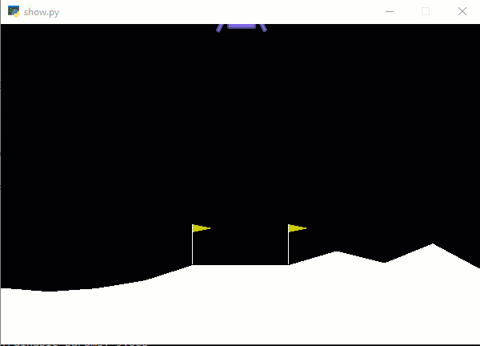

### Simple code to start on OpenAI gym
I am using DoubleDeepQAgent (see `agent.py`)

To train the model for lunar lander, run
`python lander.py`

You can control when it should stop by editing the parameters:
```python
MEAN_ARRAY_SIZE=100 # how many rewards to keep in average array, lander=100
REWARD_VALUE=200 # the reward that must be met for consecutive count to increase, lander=200
STOP_AVG=210 # stop if 100 avg is >= this and consecutive count is >= STOP_COUNT, lander > 200
STOP_COUNT=30
```

The generated models are saved into `save_lander_model` folder

If you wish to see the lander training in action set this to true:
```python
RENDER_FLAG=True
RENDER_COUNT=25 # render if consecutive count >= this
```

This will trigger lander GUI in action if the consecutive count for reward >= 200 (`REWARD_VALUE`) is met

To see how the model handles the random landing scenarios, execute
`python show.py [model]`

Example: `python show.py lander3.h5`

Sample UI




To train cart pole, run python cartpole.py.
The saved models are in save_cartpole_model directory
To see the model execute:
`python show.py [model] CartPole-v1
