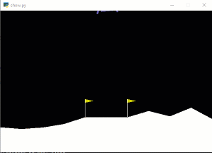

### Simple code to start on OpenAI gym
I am assuming that you have installed the necessary openai dependencies.

Additional dependency is tensorflow: `pip install -U tensorflow` or `pip install -U tensorflow-gpu`

As of today, above command will install tensorflow 1.14.0

I am using DoubleDeepQAgent (see `agent.py`)

To train the model for lunar lander, run
`python lander.py`

You can control when it should stop by editing the parameters:
```python
MEAN_ARRAY_SIZE=100 # how many rewards to keep in average array, lander=100
REWARD_VALUE=200 # the reward that must be met for consecutive count to increase, lander=200
STOP_AVG=210 # stop if 100 avg is >= this and consecutive count is >= STOP_COUNT, lander > 200
STOP_COUNT=30
```
To change the model layer size, modify this portion:
```python
    agent = DoubleDQNAgent(state_size, action_size, 
        **{'memory':1000000 , 'layer1':128 , 'layer2':64})
```
I found that 128/64 reaches solution OK, while 64/32 took longer and 32/16 took looooong time...

This is the plot of 100-episode-average score for 32/16 model.
The plot basically impiles that convergence to a solution happens rather suddenly after many, many episodes


The generated models are saved into `save_lander_model` folder

If you wish to see the lander training in action set this to true:
```python
RENDER_FLAG=True
RENDER_COUNT=25 # render if consecutive count >= this
```

This will trigger lander GUI in action if the consecutive count for reward >= 200 (`REWARD_VALUE`) is met
However, there seems to be a bug where `env.render()` call will error out after about `1000` episodes.
Thus, set `RENDER_FLAG=False` if you do not plan to sit in front of your computer to watch the training in action.

You can, instead, use below to record video every 100 episodes (or whatever you wish)
```python
env = gym.wrappers.Monitor(env, './save_video', force=True, video_callable=lambda episode_id: episode_id%100==0)
```
The saved vidoes indicate that the model learns not to crash within 100 episodes, but doesn't learn how to land until way later.

To use the above, you must have ffmpeg installed.  On windows, use `chocolatey install ffmpeg` as admin. On Mac, `brew install ffmpeg`

See https://chocolatey.org/ for details on how to install.  You may have issues, if you don't have admin rights on your Windows machine.

To see how the model handles the random landing scenarios, execute
`python show.py [model]`

Example: `python show.py lander3.h5`

Sample UI




To train cart pole, run python cartpole.py.
The saved models are in save_cartpole_model directory
To see the model execute:
`python show.py [model] CartPole-v1`

Example: `python show.py model.h5 CartPole-v1`
